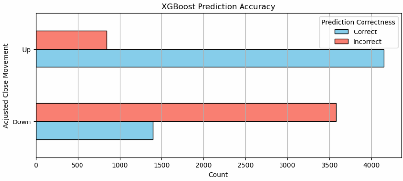
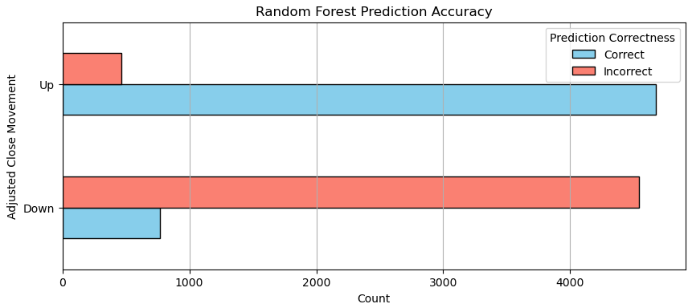
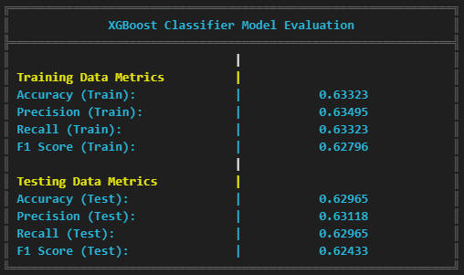
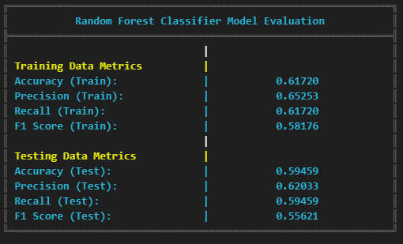
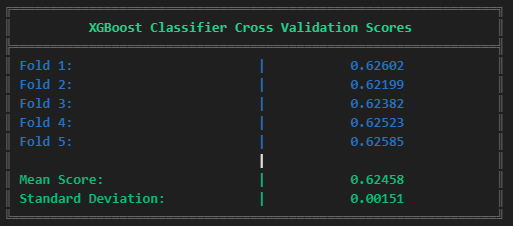
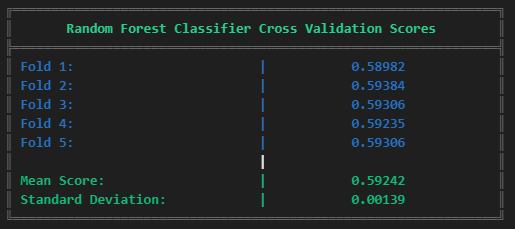

# S&P 500 Stock Movement Prediction

 
 
 
 
 
 

This project centers on predicting future price movements for S&P 500 stocks—whether prices are likely to move **up** or **down** the following day (or the following month). It integrates data collection, **feature engineering** (like Bollinger Bands, RSI, and moving averages), and training multiple machine learning models to help guide decision‐making in the stock market.

 

---

## Overview
Our project addresses the challenge of forecasting stock price direction for companies in the S&P 500 index. By blending historical stock data (spanning from 2007 onward) with various technical indicators (like moving averages, volatility, etc.), we aimed to produce *“buy”* or *“sell”* signals—helping us decide if a particular stock might move **Up** (+1) or **Down** (−1) on the following trading day.

This project applies machine learning techniques to stock market data to analyze and predict trends. It leverages several models, including **Logistic Regression**, **Random Forest**, and **XGBoost**, for classification tasks. Our goal is to evaluate model performance on stock data and compare results across these algorithms.

 

---

## Models Results Preview
 

> _**Accuracy of the S&P 500 Forecast (1-Month Horizon)**_  

  
  

 

> _**Model Evaluations**_  

  
  

 

> _**Cross-Validation Summaries**_  

  
  

 

 

## Table of Contents
- [Overview](#overview)
- [Models Results Preview](#models-results-preview)
- [Data Collection](#data-collection)
- [Data Preparation & Feature Engineering](#data-preparation--feature-engineering)
- [Model Selection & Training](#model-selection--training)
- [Evaluation & Results](#evaluation--results)
- [Key Findings](#key-findings)
- [Future Steps](#future-steps)
- [Disclaimers](#disclaimers)
- [Contributors](#contributors)
- [Data Sources](#data-sources)

 

---

## Data Collection
- **Scope of Data:** We downloaded daily “adjusted close” prices for all S&P 500 stocks starting from January 2007 to present.

- **Coverage:** Approximately 500 tickers were used; we also gathered the current day’s closing price for real-time predictions.

- **Handling Missing or Delisted Stocks:** We tracked errors in case any ticker was delisted or had incomplete data, then either excluded or treated them as needed.

 

---

## Data Preparation & Feature Engineering

### Cleaning & Merging
1. **Removing Outliers:** We dropped rows where stock prices were zero or obviously incorrect.

2. **Dealing with Missing Values:** We filled small data gaps in certain technical indicators by carrying forward or backward the last known value.

3. **Filtering Early Dates:** We avoided the earliest months to ensure our calculations for rolling indicators (like moving averages) had a proper historical window.

 

### Technical Indicators & Signals
We enriched the data with widely used **technical indicators**, including:

-  **Moving Averages** (50, 100, 200 days)
-  **Relative Strength Index (RSI)**
-  **Volatility Measures** (daily standard deviations)
-  **Bollinger Bands** (upper and lower price boundaries)
-  **Support & Resistance** (based on recent price minima and maxima)

 

> Finally, we defined **target labels** indicating **“up”** or **“down”** for each stock on the next trading day.

 

---

## Model Selection & Training

We tested **three** machine learning models:
1. **XGBoost Classifier**
2. **Random Forest Classifier**
3. **Logistic Regression**

> Each model was **trained** on **historical data** (with all the engineered features) and then **evaluated on a test set** to gauge how well it could predict unseen outcomes.

 

### Why These Models?
- **XGBoost:** Known for high performance in structured data scenarios.
- **Random Forest:** A robust, easy‐to‐interpret ensemble method.
- **Logistic Regression:** A simpler, baseline model that can be useful for interpretability.

 

---

## Evaluation & Results

We measured:
- **Accuracy:** The percentage of correct “up vs. down” predictions.
- **Precision & Recall:** How well the model correctly identifies each class (up or down).
- **F1 Score:** The harmonic mean of precision and recall, offering a balanced measure.
- **Confusion Matrix:** The exact count of correct and incorrect predictions for each category (up vs. down).

> Additionally, we performed **cross validation** (splitting data into multiple subsets for repeated training/testing) to ensure the results were not overly reliant on any one particular time period.

 

---

##  Key Findings
1. **XGBoost Performed Best**
    - We obtained an accuracy of around 63% on the test set—meaning the model correctly predicted up or down roughly 63% of the time.
2. **Random Forest & Logistic Regression**
    - Both also performed respectably but trailed slightly behind XGBoost in terms of overall accuracy and consistency.
3. **Importance of Feature Engineering**
    - Indicators like RSI and Volatility were particularly beneficial in improving model accuracy.
4. **Hyperparameter Tuning**
    - Fine‐tuning XGBoost (e.g., adjusting the maximum depth, number of trees, and learning rate) led to measurable performance gains.

 

---

##  Future Steps
1. **Longer‐term Predictions**
    - Instead of just next‐day moves, we might explore weekly or monthly returns for a broader trading strategy.
2. **Additional Data**
    - Incorporate macroeconomic factors (interest rates, GDP data) or investor sentiment from social media/news.
3. **Probabilistic Predictions**
    - Instead of a strict “up/down” call, provide the probability of an upward or downward move to aid risk management.
4. **Ensemble Stacking**
    - Combine the three different models into a “meta‐model” that can potentially outperform any single one.

 

---

##  Disclaimers
- Educational Purpose Only: This project does not constitute financial advice.
- Past Performance ≠ Future Results: Though our model may show promising results in certain windows, real‐world market behavior can differ significantly.
- Data Limitations: Some stocks in the S&P 500 may have incomplete histories or confounding corporate actions (like splits or mergers) that are not fully accounted for.

 

---

##  Contributors

- Christian Palacios ([@rune-encoder](https://github.com/rune-encoder))
- Corey Holton ([@corey-holton](https://github.com/corey-holton))
- Edwin Lovera ([@ed-lovera](https://github.com/ed-lovera))
- Vickram Dass ([@DassV24](https://github.com/DassV24))
- Montre Davis ([@tredavis](https://github.com/tredavis))

 

---

## Data Sources
This project utilizes financial data from **Yahoo Finance**, accessed via the `yfinance` library. We acknowledge Yahoo Finance as the primary source of our historical stock data.